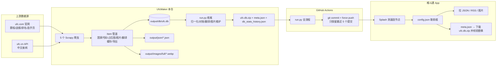
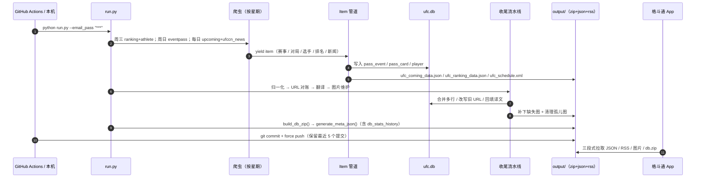
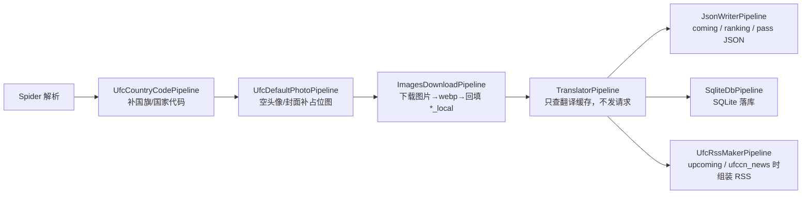
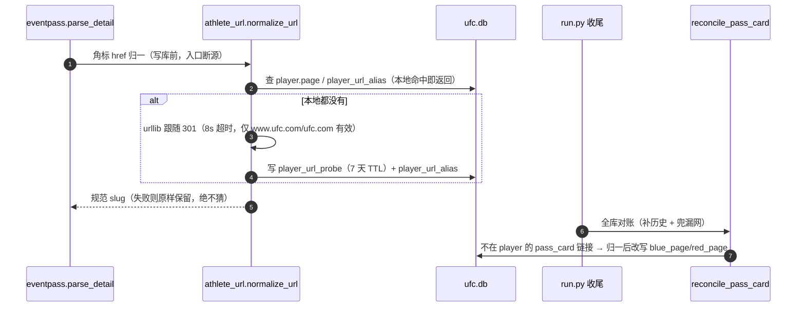
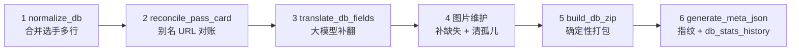

# UfcMaker — UFC 数据生产端（爬虫 + 数据包）

基于 Scrapy 的 UFC 数据爬虫：抓取赛程、历史战报、官方排名、选手档案与 UFC 中文新闻，产出
**App 可直接消费的数据包**（JSON + RSS + SQLite 库 + 镜像图片），并打包成 `ufc.db.zip` 随
`meta.json` 指纹一起下发。

> 本文同时是**数据端契约说明**的落地文档。跨端的字段口径以 `Resources/contract/` 与
> `Resources/prd/数据来源及图片地址.md` 为权威；本文只写「本仓怎么生产、怎么跑、有哪些坑」。

---

## 1. 方案路线（数据是怎么到 App 的）

本仓 = App 的数据后端。GitHub 仓库（`lxlfpeng/UfcMaker`）本身就是「数据源」，App 通过
**节点 + 数据源前缀 + 文件路径** 三段式拼接拉取，不经过任何自建服务器。



**产品定位与边界**

| 项 | 说明 |
|---|---|
| 本项目负责 | 数据抓取、清洗、翻译、图片镜像、版本指纹、打包下发 |
| 本项目不负责 | 任何服务端接口；App 直接读仓库文件（GitHub raw / gh-proxy 等节点） |
| 第二数据源 | `DogMaker`（Sherdog 源）与本仓**路径与结构同构**：同名同路径的 7 个 JSON + `output/db/ufc.db.zip` + `output/images/` 同相对路径。App 设置里切数据源即切前缀，**连图片一起切** |
| 手维护文件 | `output/json/config.json`、`output/json/app_version.json`、`output/apks/`、`output/images/asset/`（其余产物全部自动生成，**不要手改**） |

### 三段式地址规则（端上按此拼接）

```
完整 URL = <当前节点> + <数据源前缀> + <文件路径>
图片地址 = <当前节点> + <数据源前缀> + output/images/ + <*_local 相对路径>
```

- 节点、前缀、路径**原样相接**，不得补斜杠（节点不带尾斜杠、`prefix` 自带前后斜杠）；
- 数据源前缀来自 `config.json.data_sources`（`default: true` 项为默认；`prefix` 为空的条目端上置灰）；
- `download_url`（APK）固定使用**默认项**前缀，不随数据源切换。

---

## 2. 时序图

### 2.1 调度总时序（CI / 本地 `run.py`）



### 2.2 单个 item 的管道流



> 管道顺序定义在 `ufcjson/settings.py` 的 `ITEM_PIPELINES`。图片管道是**异步**的
> （下载完成才继续往后走），所以从 yield 到落库之间隔着一次图片下载。

### 2.3 选手主页 URL 的两道归一



---

## 3. 爬虫清单（5 个）

| 爬虫 | 作用 | 落点 | 判重键 | 调度（run.py） |
|---|---|---|---|---|
| `upcoming` | 即将到来的赛事 + 对局（赔率 / 排名 / `fight_id`） | `ufc_coming_data.json`（**不落库**）+ RSS 对局条目 | — | 每日 |
| `eventpass` | 已结束赛事战报；顺带抓参赛选手页 | `pass_event` / `pass_card` / `player` | 赛事 `page`；对局三维；头像老值 | 周日（增量） |
| `ranking` | 各级别 + P4P 官方排名 | `ufc_ranking_data.json`（**不落库**） | — | 周三 |
| `athlete` | 运动员档案（列表 + 详情） | `player` | `(page, record)` | 周三（全量分页） |
| `ufccn_news` | UFC 中文站新闻（RSS 用） | `output/rss/`（经 RSS 管道合并） | 已发布 ID（`published_ids.json`） | 每日 |

**各爬虫要点**

- **upcoming**：`?page=N` 不翻页，只取 upcoming 列表全部条目；对局含红/蓝赔率与排名行
  （`rank` 由页面 ranks 行给出，`C` 表示冠军位）；`fight_id` 用于 RSS 去重。
- **eventpass**：
  - 只认 `#events-list-past` 区块；列表按 `?page=N` 翻页（每页 8 条，`MAX_PAGES=300`）；
  - **空壳对局过滤**：两侧 `<a href>` 指向同一链接的卡直接跳过（ufc.com 渲染缺陷，全库实测零误伤）；
  - 对局写入按 `(fight_page, blue_page, red_page)` 兜底：命中则只覆盖非空值（防「赛前空结果」盖掉「赛后结果」）；
  - 顺带抓参赛选手页（见 §8.4 头像策略、§8.5 生日推断）；
  - ⚠️ `run.py` 里 eventpass **不带 `pagination`**，只翻第 1 页（最近 8 场）——漏跑需手动全量补（见 §9）。
- **athlete**：默认只抓第 1 页；`-a pagination=true` 全量。列表页取头像缩略图与战绩，详情页
  覆盖记录/量级/身体数据/历史/胜场统计；**详情页不取头像**。
- **ufccn_news**：`start_urls` 是占位 GET，真实请求为 `POST http://www.ufc.cn/Api/Handler.ashx`；
  产出经 RSS 管道与 upcoming 的对局条目合并后写出。
- **ranking**：周三跑，排名 JSON 条目只有 `name / page / rank_name / rank` 四个字段
  （**没有 `rank_name_cn`**，端上按数据出现顺序做档位）。

**Item 一览**（定义见 `ufcjson/items.py`）：

| Item 类 | 去向 |
|---|---|
| `UfcComingItem` / `UfcComingCardItem` | `ufc_coming_data.json` + RSS 对局条目 |
| `UfcPassItem` / `UfcPassCardItem` | `pass_event` / `pass_card`（并由库生成 pass JSON） |
| `UfcRankingItem` | `ufc_ranking_data.json` |
| `UfcPlayerItem` | `player` 表（头像/封面经图片管道回填 `*_local`） |
| `UfcCnNewsItem` | RSS 新闻条目 |

---

## 4. 使用方式

### 4.1 仓库结构（速览）

```
UfcMaker/
├── run.py                     # 调度入口：按星期跑爬虫 + 收尾流水线 + zip/meta
├── scrapy.cfg                 # Scrapy 项目配置
├── requirements.txt
├── ufcjson/                   # Scrapy 工程
│   ├── items.py               # Item 定义（赛事 / 对局 / 排名 / 选手 / 新闻，共 7 类）
│   ├── settings.py            # 管道顺序 / 图片 / 日志 / UA
│   ├── middlewares.py         # 爬虫中间件：异常 → 邮件告警
│   ├── spiders/               # 5 个爬虫（upcoming / eventpass / ranking / athlete / ufccn_news）
│   ├── pipelines/             # 国旗 / 占位图 / 图片 / 翻译 / JSON / SQLite / RSS
│   ├── athlete_url.py         # 别名 slug 归一 + 全库对账（见 §8.2）
│   ├── normalize.py           # 选手多行合并（见 §8.1）
│   ├── translator.py          # 翻译调度（阶段二）
│   ├── llm_translator.py      # 大模型后端（OpenAI 兼容）
│   ├── translate_cache.py     # 翻译缓存表统一出口
│   ├── db_stats.py            # 库内容盘点账本
│   ├── birth_place.py         # 出生地拆分 + 出生年推断（见 §8.5）
│   ├── rss.py / export.py     # RSS 组装工具 / JSON 导出工具
│   └── inline_requests/       # 内联请求辅助
├── scripts/                   # 辅助脚本（下表）
├── .github/workflows/main.yml # CI：run.py + 提交推送（见 §4.5）
├── output/                    # 全部产物（结构见 §6）
└── log/scrapy_log.log         # 运行日志（目录需先建，见 §9 第 2 条）
```

| 脚本 | 用途 |
|---|---|
| `image_maintenance.py` | 补下缺失图 + 清孤儿图（`run.py` 收尾自动调用） |
| `backfill_event_results.py` | 手动回填「两侧结果都空」的对局（幂等；`--apply` 后重建 zip/meta） |
| `clear_translations.py` | ⚠️ 不可逆：清空库内全部 `*_cn` + 翻译缓存（换翻译链路时全量重翻用） |
| `test_translation.py` | 翻译质量抽样 / 指定文本试翻 |
| `send_email.py` | 异常告警邮件（`middlewares.py` 调用，163 SMTP） |
| `country.py` / `db.py` | 国家 emoji 映射 / 建表语句参考（历史工具） |

### 4.2 环境与安装

```bash
python -m pip install -r requirements.txt   # Python 3.12+（CI 实测 3.12 / 本机 3.13 可跑）

mkdir -p log                                # ⚠️ 必须：LOG_FILE=./log/scrapy_log.log，目录缺失 Scrapy 直接报错
```

依赖见 `requirements.txt`：Scrapy 2.19 / openai / itemadapter / pycountry / PyRSS2Gen / Pillow。

### 4.3 单独跑某个爬虫

```bash
scrapy crawl upcoming                       # 即将到来的赛事（含 RSS 对局条目）
scrapy crawl eventpass                      # 历史赛事（增量：第一页 8 场）
scrapy crawl eventpass -a pagination=true   # 历史赛事（全量分页，回填用）
scrapy crawl ranking                        # 官方排名
scrapy crawl athlete                        # 选手（第一页）
scrapy crawl athlete -a pagination=true     # 选手（全量）
scrapy crawl ufccn_news                     # UFC 中文新闻（RSS）
```

爬虫参数：

| 参数 | 适用 | 默认 | 说明 |
|---|---|---|---|
| `-a pagination=true` | eventpass / athlete | false | 全量翻页；`"false"` 等字符串也按 false 处理 |
| `-a normalize_urls=false` | eventpass | true | 关闭写库前的「别名 slug 在线探测」（见 §9 第 10 条） |

> ⚠️ 只跑单个爬虫不会执行收尾流水线（翻译 / 元信息 / zip），产物可能不完整；完整一轮请走 `run.py`。

### 4.4 调度入口 `run.py`

```bash
python run.py                       # 按当前星期自动执行
python run.py --email_pass "***"    # 推荐带引号（token 未配置时避免 argparse 缺值报错）
```

| 星期 | 执行的爬虫 |
|---|---|
| 周三 | `ranking` + `athlete`（全量分页） |
| 周日 | `eventpass`（增量） |
| 每天 | `upcoming` + `ufccn_news` |

`run.py` 顶层即执行爬虫（`import run.py` 会直接开跑，脚本里别 import 它——见 §9 第 3 条）。

环境变量（翻译与告警）：

| 变量 | 用途 | 必填 |
|---|---|---|
| `LLM_API_BASE` / `LLM_MODEL` / `LLM_API_KEY` | 大模型翻译（OpenAI 兼容） | 翻译必填，缺省则跳过翻译并打印提示 |
| `LLM_BATCH_SIZE` / `LLM_TIMEOUT` / `LLM_MAX_RETRIES` | 翻译批大小（默认 50）/ 超时（120s）/ 重试（3） | 否 |
| `email_pwd`（由 `--email_pass` 注入） | 抓取异常时发告警邮件（`smtp.163.com:25` → `lxlfpeng@163.com` → `565289282@qq.com`） | 否 |

### 4.5 CI（GitHub Actions）

`.github/workflows/main.yml`：

1. `checkout`（浅克隆，`fetch-depth: 4`）→ 装依赖 → `python run.py --email_pass ${{ secrets.EMAIL_TOKEN }}`；
2. `git add . && git commit` 后，用 `git commit-tree` **重建最近 5 个提交**再 `force push`
   —— 远端历史被真正截断，仓库不会无限膨胀；
3. 翻译用 `LLM_*` secrets，邮件用 `EMAIL_TOKEN` secret。

> ⚠️ 当前 workflow 的 `on:` 触发段是**注释状态**（定时/推送均未开启），需要时手动启用或
> 从 Actions 页面触发。

---

## 5. run.py 收尾流水线（顺序固定）



| # | 步骤 | 做什么 | 失败策略 |
|---|---|---|---|
| 1 | `ufcjson/normalize.py` | 按「归一化姓名 + 首秀日」合并同人多行，改写 `pass_card` 旧 URL，写 `player_url_alias` | 警告，不中断 |
| 2 | `ufcjson/athlete_url.py` | 全库对账 `pass_card` 里不在 `player` 的链接（别名 slug → 规范 slug） | 警告，不中断 |
| 3 | `ufcjson/translator.py` | 扫描「原文非空、译文为空」字段，批量翻译并回填 `*_cn` | 失败批次不写缓存，下次重试 |
| 4 | `scripts/image_maintenance.py` | `download_missing()` 补下缺失图 + `cleanup_unused()` 清孤儿图 | 警告，不中断 |
| 5 | `build_db_zip()` | 确定性打包（固定时间戳/权限位/宿主系统），同一份库产出逐字节相同的 zip | 警告，不中断 |
| 6 | `generate_meta_json()` | 生成 `meta.json`（含 zip 指纹），并**同批**追加 `db_stats_history.json` 一条盘点 | 失败仅打印 |

> 顺序不可调换：`db_md5 / db_zip_md5` 必须是**最终库**的指纹，客户端据此判断是否需要下载新库。

---

## 6. 输出产物与跨端契约

```
output/
├── db/
│   ├── ufc.db                 # 主库（业务 3 表 + 辅助 2 表）
│   ├── ufc.db.zip             # 下发用压缩包（确定性打包）
│   └── ufc_translate.db       # 翻译缓存库（不下发）
├── json/
│   ├── config.json            # 手维护：节点 / 数据源 / 二维码
│   ├── app_version.json       # 手维护：发版信息（版本/下载地址/大小/日志）
│   ├── meta.json              # 自动：数据库版本指纹
│   ├── db_stats_history.json  # 自动：库内容盘点账本（append-only）
│   ├── ufc_coming_data.json   # 自动：即将到来的赛事
│   ├── ufc_pass_data.json     # 自动：最新 8 场历史战报（端上本期未消费）
│   └── ufc_ranking_data.json  # 自动：官方排名
├── rss/
│   ├── ufc_schedule.xml       # 自动：RSS 2.0（对局 + 中文新闻，最多 100 条）
│   └── published_ids.json     # 自动：防重发台账（⚠️ 别删，删了会重发）
├── images/
│   ├── full/                  # 自动：镜像图片（webp，文件名 = URL 的 SHA1）
│   └── asset/qr-code.png      # 手维护：关于页二维码
└── apks/                      # 手维护：发布 APK（ASCII 名 + 版本号，如 gedoutong-1.0.0.apk）
```

### 6.1 统一信封

除 RSS（RSS 2.0 原文）外，所有 JSON 都是同一信封：

```json
{ "code": 0, "msg": "success", "data": { }, "timestamp": 1790305255000 }
```

端上成功判定 = **完整返回 + 合法 JSON + `code == 0`** 三条件齐验（HTML 假成功判失败）。

### 6.2 各文件字段（生产端口径）

**config.json**（手维护）

| 字段 | 说明 |
|---|---|
| `schema_version` | 结构版本 |
| `hosts[]` | 候选节点（**纯节点**形态，不带仓库段）。2026-10-02 起含官方源 `https://raw.githubusercontent.com` 共 6 条 |
| `data_sources[]` | `{name, prefix, default}`；`prefix` 自带前后斜杠；`default: true` 为默认项（端上 `config` 与 APK 固定走它） |
| `qrcode.image` | **相对 `output/images/`** 的路径（现为 `asset/qr-code.png`，端上拼三段式） |

**app_version.json**（手维护，发版时更新）

| 字段 | 说明 |
|---|---|
| `latest_version` / `latest_version_code` | 最新版本（语义化 + 整数），端上用 **code 数值**比较 |
| `minimum_version` / `minimum_version_code` | 保留字段（本期不参与强制判定） |
| `force_update` | 唯一强制升级依据 |
| `release_date` | 发布日 `YYYY-MM-DD` |
| `download_url` | APK 相对路径（ASCII 文件名带版本号），端上拼**默认项前缀** |
| `size` | APK **实际字节数**（端上弹窗「大小」段；缺失则整段隐藏） |
| `changelog.zh` / `changelog.en` | 更新日志（进度条之外的唯一文案来源） |

**meta.json**（自动）

| 字段 | 说明 |
|---|---|
| `schema_version` | 结构版本 |
| `last_updated` / `last_updated_ts` | 内容最后变更时间（ISO 东八区 / Unix 秒）；数据没变则**沿用旧值** |
| `generator` / `spiders_run` | 生成方 / 本轮跑了哪些爬虫 |
| `athlete_count` / `pass_event_count` | 来自 `player` / `pass_event` |
| `upcoming_event_count` / `ranking_count` | 来自 coming / ranking JSON 条目数 |
| `db_md5` / `db_size` | **解压后**库文件指纹（客户端解压后校验） |
| `db_zip_md5` / `db_zip_size` | **压缩包**指纹（客户端先校验包） |
| `_db_data_version` / `_coming_hash` / `_ranking_hash` | 内部指纹（判断「是否有更新」用，契约未列） |

**db_stats_history.json**（自动，append-only 账本）

- `entries[]`：`{ts, date, tables, coverage, quality, external}`，一次刷库一条，**数据没变则跳过**；
- 记录总数 = `tables.player + pass_event + pass_card`（端上现算）；
- `coverage` / `quality` 是趋势指标（如 `player.birthdate` 与 `birthdate_full` 成对，可区分「仅年份」）；
- 消费方：App「数据库更新记录」（仅 debug 构建）+ 人工看趋势。

**ufc_coming_data.json**（自动，`data` 为赛事数组）

| 字段 | 说明 |
|---|---|
| `name` / `title` | 赛事名（如 `UFC333`）/ 头条主赛标题 |
| `page` | 赛事详情页完整 URL |
| `main_time` / `prelims_time` / `data_early_time` | 主/副/早卡 Unix 秒（**字符串**，可能为空串） |
| `address` | 举办地英文原文 |
| `banner` / `banner_local` | 横幅原图（**端上禁用**）/ 镜像相对路径（端上必用） |
| `fight_card[]` | `card_type`（Main/Prelims/EarlyPrelims）、`fight_name`、`card_division`、`red_page`/`blue_page`、`red_odds`/`blue_odds`（可能为 `-`）、`red_rank`/`blue_rank`（`#N`/`C`/空串）、`fight_id`、`main_time`、`address` |

**ufc_ranking_data.json**（自动）：`{name, page, rank_name, rank}`；`rank = 0` 为冠军，1..15 有名次并列。

**ufc_pass_data.json**（自动）：从库中取 `CAST(main_time AS INTEGER) DESC` 的**最新 8 场**，字段为 coming 同构 + 战报结果（`red_result`/`blue_result`/`end_*`/`odds`）；用 `url` 字段表示赛事链接，对阵数组名为 `fight_cards`；写文件为**先临时文件再原子替换**。

**ufc_schedule.xml**（自动，RSS 2.0）：对局与中文新闻合并，**最多 100 条**（`MAX_RSS_ITEMS`）；
对局条目含对阵、级别、时间、双方照片（已按 §8.4 规则换成可直连/镜像地址）；新闻条目含正文 HTML。

---

## 7. 数据模型（ufc.db）

### 7.1 表清单

| 表 | 说明 |
|---|---|
| `pass_event` | 历史赛事（`page` UNIQUE） |
| `pass_card` | 历史对局（三维兜底：`fight_page + blue_page + red_page`） |
| `player` | 选手档案（`page` UNIQUE） |
| `player_url_alias` | 别名 slug 对照表（`old_page` UNIQUE → `new_page`） |
| `player_url_probe` | URL 探测缓存（`url` PK / `final` / `checked_at`，7 天 TTL） |

> 下发 zip 的 5 张表 = 业务 3 + 辅助 2；`sqlite_sequence` 是 SQLite 内建。App 端另有 8 张自建表，
> 合计 13 张（见 `db-schema` 契约）。

### 7.2 `player` 字段（35 列）

| 字段 | 说明 |
|---|---|
| `id` / `name` / `name_cn` | 主键 / 英文名 / 中文名 |
| `nick_name` / `nick_name_cn` | 昵称（页面原文含引号，入库前剥引号）/ 中文 |
| `page` | 选手主页 URL（**UNIQUE**，端上精确等值匹配的键） |
| `division` / `division_cn` | 量级（如 `Flyweight Division`）/ 中文 |
| `avatar` / `avatar_local` | 头像 URL / 镜像相对路径（`full/<sha1>.webp`） |
| `cover` / `cover_local` | 全身照 URL / 镜像相对路径 |
| `record` | 战绩，形如 `17-2-0 (W-L-D)`（展示端自行剥括号段） |
| `status` / `status_cn` | 职业状态 / 中文 |
| `home_town` | 出生地原始值（`City, Country`） |
| `city` / `city_cn` / `country` / `country_cn` | 出生地拆分（拆不出城市时 `city` 为空） |
| `team` / `team_cn` / `style` / `style_cn` | 团队 / 风格 |
| `height` / `weight` / `reach` / `leg_reach` | 英寸 / 磅 / 英寸 / 英寸（端上换算 cm / kg） |
| `debut` | UFC 首秀日期 |
| `history` / `history_cn` | 历史战绩（JSON 数组字符串） |
| `wins_stats` / `wins_stats_cn` | 获胜方式统计（`[{"way","times"}]`） |
| `flag` | 国旗（emoji） |
| `birthdate` | 生日：`YYYY-MM-DD`（精确）或 `YYYY`（近似，见 §8.5）；**无 `age` 列**，年龄由端上现算 |

### 7.3 `pass_event` / `pass_card` 字段

`pass_event`：`id, name, name_cn, title, title_cn, banner, banner_local, address, address_cn, page(UNIQUE), main_time, prelims_time, data_early_time, city, city_cn, country, country_cn`。

`pass_card`：`id, fight_page, blue_page, red_page, blue_result, red_result, blue_odds, red_odds, end_method, end_method_cn, end_round, end_time, card_type, card_division, card_division_cn`。

> 时间列都是 **Unix 秒的字符串**（TEXT）；比较大小必须 `CAST(... AS INTEGER)`，字符串排序会把
> 9 位时间戳（1970–2001）排到最前。

### 7.4 `ufc_translate.db`

翻译缓存库（不下发）：`translate(id, original, translation)`（`original` 有唯一索引，写入用
`INSERT OR IGNORE`）+ `translate_miss`（记录「问过大模型但没拿到译文」的原文与尝试次数）。
建表/去重/索引统一走 `ufcjson/translate_cache.py`，别处不要再手写 DDL。

---

## 8. 专题机制

### 8.1 选手主页 URL 变更与多行归一化（`normalize.py`）

**问题从哪来**：`player.page` 被当作选手唯一标识（`UNIQUE` + 端上精确匹配 + `pass_card` 引用）。
ufc.com 改过亚洲选手拼音顺序（如 `yadong-song` → `song-yadong`），同一个人的记录会断成两行：
**战绩挂在旧 URL 上，而榜单/赛事页给的是新 URL**，端上只看到一半。

**怎么修**（导出层收尾，不改抓取逻辑）：

1. **分堆** — 按「归一化姓名 + 归一化首秀日」给 `player` 全表分堆。
   - 姓名：NFKD 去音标 → 只留 `[a-z0-9]` → 小写；
   - 首秀日：`Nov. 25, 2017` → `2017-11-25`；
   - ⚠️ 只用姓名会被同名不同人误伤：`bruno silva`（`bruno-silva-blindado` / `bruno-silva`）与
  `joey gomez` 都是真实的两个人，靠首秀日才分得开——首秀日是必需项，不是可选项。
2. **选保留行** — 堆内 `record` 有效的行里留 **`id` 最大**者。
   - 依据：`id` 严格递增，新 slug 必然后 INSERT；「id 最大 = 站点当前 slug 行」（前提：slug 单向变更）。
   - ⚠️ 已知盲区（接受，暂不加防护）：slug **回退**（A→B→A 且两行共存）时可能保留过期的 B；
     需双重巧合才触发，且下轮会以更大 `id` 重新 INSERT 后自愈。
3. **改写与落盘** — 删其余行，把「旧 URL → 保留 URL」写进 `player_url_alias`，并按表改写
   `pass_card.blue_page / red_page`。

**两道保护**：

- **空壳行守卫**（自动）：只在 `record` 有效（总场次 > 0）的行里选，整堆无效就不动；
- **白名单 `MERGE_WHITELIST`**（人工核对）：处理「首秀日也被改过」的堆。新白名单必须逐项核对过人属性，
  键 = 归一化姓名，值 = 保留的 `page`（须与库里逐字一致）。

**历史战绩取并集**：保留行覆盖不到的一两场并入（同日只留保留行的），变长后清空 `history_cn` 触发重译。

**怎么跑**：

```bash
python -m ufcjson.normalize                 # dry-run
python -m ufcjson.normalize --apply         # 落盘（先 VACUUM INTO 备份，再单事务）
python -m ufcjson.normalize --db /tmp/ufc.db --apply
```

`run.py` 已接入，每次爬完自动执行；**幂等**（合并过的库第二次跑报「0 组」）。

### 8.2 别名 slug 对账（`athlete_url.py`）

与 §8.1 的「多行合并」是两件事：这里是**同一行的 URL 写法不一致**（赛事页角标可能是别名 slug）。

- 归一顺序（逐级降级，本地命中不发请求）：① 已在 `player.page` → 原样返回；② 命中
  `player_url_alias` → 返回映射；③ 在线 301 探测 → 登记别名表；④ 都不行 → 返回 `None`，**保持原值绝不猜**；
- 探测有**域名守卫**：最终地址必须仍在 `www.ufc.com` / `ufc.com`，否则判失败（大陆 IP 会被整站
  301 到 `ufc.cn`，不守会把 slug 写成 ufc.cn 地址）；
- 失败/无变化的结果写 `player_url_probe`，7 天 TTL 内不重复探测；
- `run.py` 收尾的 `reconcile_pass_card()` 对全库 `pass_card` 兜底（补历史 + 兜漏网）。

### 8.3 中文翻译（两阶段）

**阶段一（爬虫运行时，`TranslatorPipeline`）**：打开 `ufc_translate.db` 按原文查缓存；命中写 `*_cn`，
未命中留空、**不发任何网络请求**；列表型字段只要有一个元素未命中，整列都不写（全交给阶段二）。

**阶段二（跑完后，`translator.translate_db_fields()`）**：

1. 收集各表「原文非空、译文为空」的字段，去重；
2. 用缓存剔除已翻译文本；
3. 剩余文本按批（默认 50 条）交 `llm_translator`（OpenAI 兼容 chat completions）；
4. 每批成功即写缓存（中断不丢已完成部分）；
5. 按译文映射回填各表 `*_cn`。

**翻译范围**：`player`（name / nick_name / city / country / division / status / team / style +
`history`→`history_cn`、`wins_stats`→`wins_stats_cn` 的 `way`）；`pass_event`（name / title / address / city / country）；
`pass_card`（end_method / card_division）。JSON 列保持结构、只翻文本，**全部元素成功才写入**。

**领域提示词**：内置 MMA/UFC 词典（量级、结束方式、人名音译、地点从大到小、日期 `YYYY年M月D日`），
返回做容错解析（剥 ```json 围栏、截取首个 `[...]`、数量不足补空、多余截断）。

### 8.4 图片：样式、清晰度与维护

**命名与存储**：文件名 = 完整 URL 的 SHA1 + `.webp`，存 `output/images/full/`；
库里的 `*_local` 存相对路径（`full/<sha1>.webp`）。URL 变 = 文件名变 = 旧图成孤儿（由清理步骤删除）。

**样式与清晰度（2026-10-02 现状）**：

| 来源 | 样式 | 尺寸 | 说明 |
|---|---|---|---|
| eventpass 抓到的选手头像 | `inline` | 520×325 | 由 `event_results_athlete_headshot`（256×160，同裁切）**样式段替换**而来，2.03× 放大 |
| athlete 列表页头像 | `teaser` | 竖图缩略 | 新增选手的另一条写图路径 |
| 全身照 / 横幅 | `athlete_bio_full_body` / `background_image_sm` 等 | — | 原样落库 |

- **itok 不强制校验**：站点输出 `?itok=` 但不校验（换样式带旧 token → 200、不带 token → 200，
  只有不存在的样式名/源文件才 403）。所以换样式段当前可用，**但这是站点一个开关就能收回的行为**
  （真收紧时表现为下载 403 → `*_local` 为空 → 端上落占位图）。
- **头像老值冻结**：`extract_avatar` 优先返回库内已存的真实头像（防止两种裁切风格互相覆盖）；
  **占位剪影除外**——占位不算「老头像」，站点后来补了真头像会被升级回来。
- 下载走 `ImagesDownloadPipeline`：`IMAGES_EXPIRES = 20000` 天（≈永不过期，本地有文件就跳过）；
  `MEDIA_ALLOW_REDIRECTS = True`（`ufc.com → www.ufc.com` 的 301 必须放行）。

**占位图（全库统一两类）**：

| 场景 | 占位 |
|---|---|
| 选手头像缺失 | `https://www.ufc.com/themes/custom/ufc/assets/img/no-profile-image.png` |
| 选手全身照缺失 | `SHADOW_Fighter_fullLength_RED.png`（cloudfront） |

**维护命令**（`scripts/image_maintenance.py`）：

```bash
python -m scripts.image_maintenance --download              # 补下缺失 + 回填 *_local
python -m scripts.image_maintenance --cleanup --dry-run     # 预览孤儿图
python -m scripts.image_maintenance --cleanup               # 删除孤儿图（有二次确认）
python -m scripts.image_maintenance --all                   # 两者连做
```

> `run.py` 收尾会自动执行 `download_missing + cleanup_unused`（无人值守，自动确认）。

### 8.5 生日与年龄（`birthdate`）

- ufc.com **不发布生日**（只有整数 `Age`，且退役/DWCS 页可能没有该字段）；
- **精确生日**来自 Sherdog（`itemprop="birthDate"`，历史回填写入），UPDATE 分支**永不覆盖**该列；
- **新选手自动化兜底**（2026-10-02 拍板）：新行入库时若页面有 `Age`，按 `出生年 = 今天年份 − Age`
  写入 `YYYY`（近似值，误差窗口最多一年；非数字/越界不写）。实现见 `ufcjson/birth_place.py::infer_birth_year()`；
- ⚠️ **精确回填断点必须是 `LENGTH(birthdate) < 10`**（完整日期正好 10 字符）——否则 `'1993'`
  会被当成「已有值」跳过，近似值变永久死值（见 `.workbuddy/memory/DB-NOTES.md` §1.9.7）；
- 跨产品口径：App 端支持 `YYYY`（按近似值展示年龄）；**RSS 输出仍只认 `YYYY-MM-DD`、近似值留空**
  （有意的差异，不得「顺手统一」）。

---

## 9. 注意点与已知坑

1. **大陆网络访问不了 ufc.com**：整站 301 → `ufc.cn` → 404；图片只有
   `dmxg5wxfqgb4u.cloudfront.net/styles/<样式>/s3/<路径>` 能直连（注意路径**不带** `/images/`）。
   本地开发建议只读库/JSON，抓取交给 CI（海外 IP）。
2. **`log/` 目录必须先存在**：`LOG_FILE=./log/scrapy_log.log`，目录缺失 Scrapy 直接
   `FileNotFoundError`（CI 上踩过）。
3. **`run.py` 顶层会直接跑爬虫**：任何脚本想复用它的打包/meta 逻辑，**照抄**而不是 `import`
   （`backfill_event_results.py` 就是这么做的）。
4. **`--email_pass` 记得加引号**：CI 里 `EMAIL_TOKEN` 未配置时，裸变量会让 argparse「缺值」直接退出。
5. **zip 是确定性打包**：固定时间戳/权限位，别手工重打；否则每天提交一个新 blob，仓库无限膨胀。
6. **手维护文件清单**：`config.json`、`app_version.json`（发版改版本/`size`=实际字节数/`download_url`，
   APK 用 ASCII 名带版本号）、`output/apks/`、`output/images/asset/`——这些不自动生成，改完记得提交。
7. **头像冻结策略**：已存的真实头像不会被后续抓取替换（防两种裁切风格互踩）；只有「占位 → 真头像」
   允许升级。想让某个选手换图，得先清掉库里的 `avatar`。
8. **`published_ids.json` 别删**：RSS 靠它 + 旧 coming JSON 防重发；删了会触发「首次运行」逻辑。
9. **eventpass 增量只翻第 1 页**（最近 8 场）：盯一下调度是否正常；漏跑几天以上要手动
   `scrapy crawl eventpass -a pagination=true` 补（否则旧赛事滚出首页后永不回补）。
10. **别名探测是阻塞调用**：`normalize_urls` 的在线 301 探测（urllib，8s 超时）跑在 Scrapy
    reactor 线程里，未命中本地缓存时会卡住整个爬虫。日常增量影响极小（探测结果 7 天缓存 +
    老赛事跳过）；**大回填时建议 `-a normalize_urls=false`**，交给收尾的 `reconcile_pass_card` 兜底。
11. **`meta.json` 与 `db_stats_history.json` 必须同批生成**：两者日期不同步会让 App「更新记录」页
    恒走「暂无与当前版本匹配的记录」降级（历史问题，见 App 侧登记 C15）。
12. **改字段 = 改跨端契约**：端上按 `Resources/contract/data-files.md` 与各 PRD 实现；
    新增/更名/删字段前先对契约，别只改生产端。
13. **超长列表的时间比较**：`main_time` 等是 TEXT，一切排序/筛选用 `CAST(... AS INTEGER)`。
14. **翻译失败不阻塞**：未配置 `LLM_*` 时整段跳过（`*_cn` 保持空），下次跑自动重试；缓存库独立，
    误清 `ufc_translate.db` 只会导致重翻，不丢主库数据。

---

## 10. 数据来源与合规

所有数据抓取自 [UFC 官网](https://www.ufc.com)（新闻来自 [UFC 中文站](http://www.ufc.cn)），
仅供学习研究使用。请遵守网站使用条款，合理控制爬取频率。

## 11. 依赖

见 `requirements.txt`：

- **Scrapy** — 爬虫框架（2.19）
- **openai** — 大模型翻译客户端（OpenAI 兼容接口）
- **pycountry** — 国家代码查询
- **PyRSS2Gen** — RSS Feed 生成
- **Pillow** — 图片处理（webp 转换）